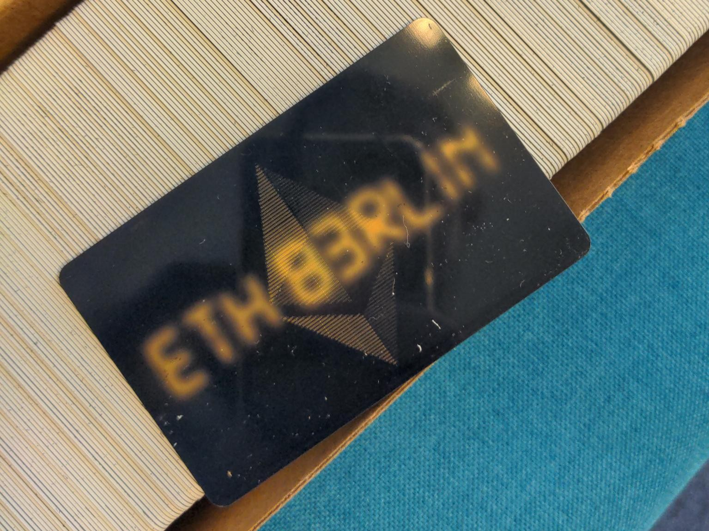

# List of ETHBerlin³ Attendees

This is a list of all ETHBerlin³ attendees. This list is completely anonymous as each hacker gets a fresh EtherCard at the registration desk.
- [attendees.csv](./attendees.csv)
- [attendees.json](./attendees.json)
- [attendees.xml](./attendees.xml)

It is at the discretion of each participant to use the cards or link their identity.

The purpose of this repository is to encourage everyone to use these public addresses to incorporate them into your project:
- grant access to your DApp
- airdrop testnet tokens
- mint unique NFTs
- _your idea here_

Here's a sample (0523/1000):
- https://goerli.etherscan.io/address/0xb21258673A2d9990E8f06A178a2a9D95E4737AF6
- https://sepolia.etherscan.io/address/0xb21258673A2d9990E8f06A178a2a9D95E4737AF6

Have fun!
